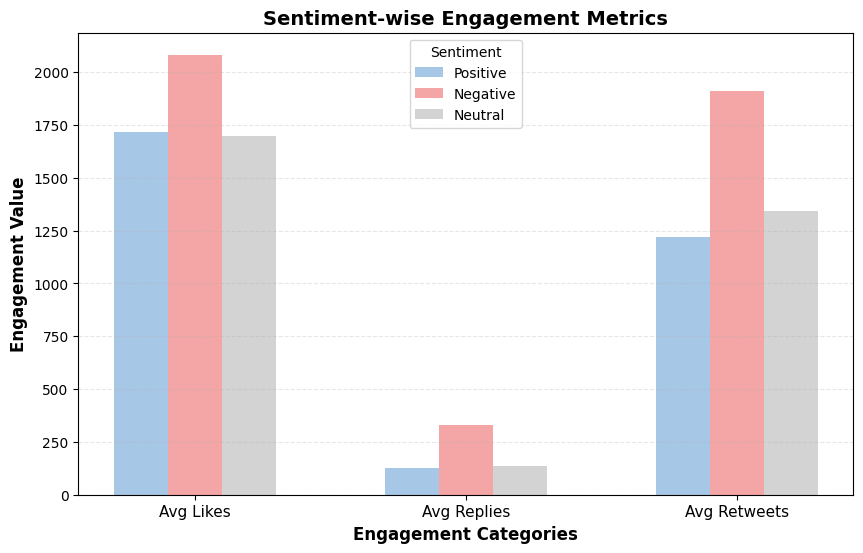
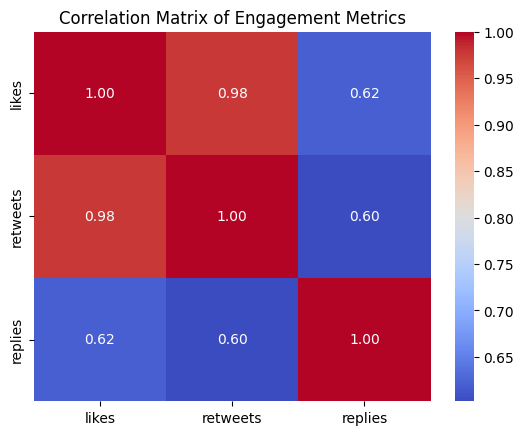

# Understanding Brand Perception using Social Media Posts
- Built a sentiment analysis pipeline for ~25K Tesla-related Twitter and Reddit posts using a fine-tuned RoBERTa model.
- Developed an end-to-end system for data collection, preprocessing (text, emojis), and sentiment classification via APIs.
- Extracted key themes from labelled posts using LDA and Gemini to generate insights that enhance brand perception analysis.
- Visualised sentiment trends and topic distributions with Seaborn & Matplotlib, enabling clear communication and understanding.

## Sample of Results

